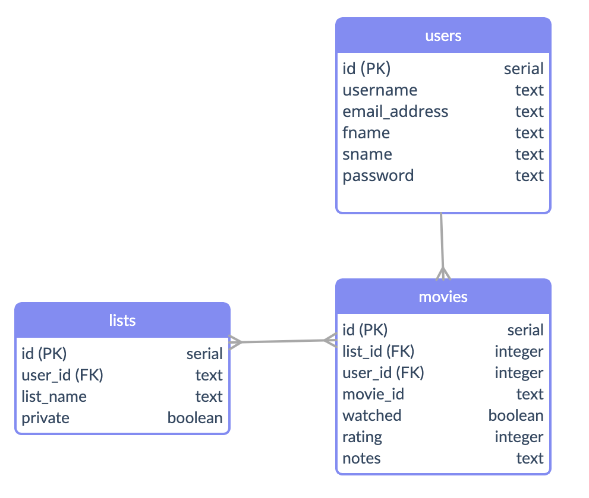
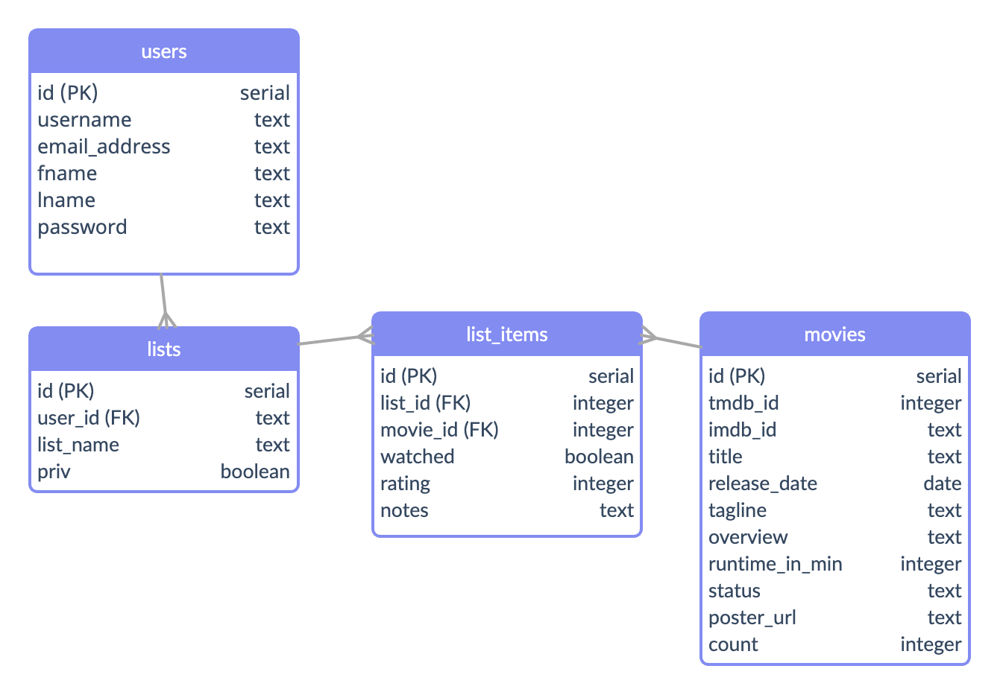
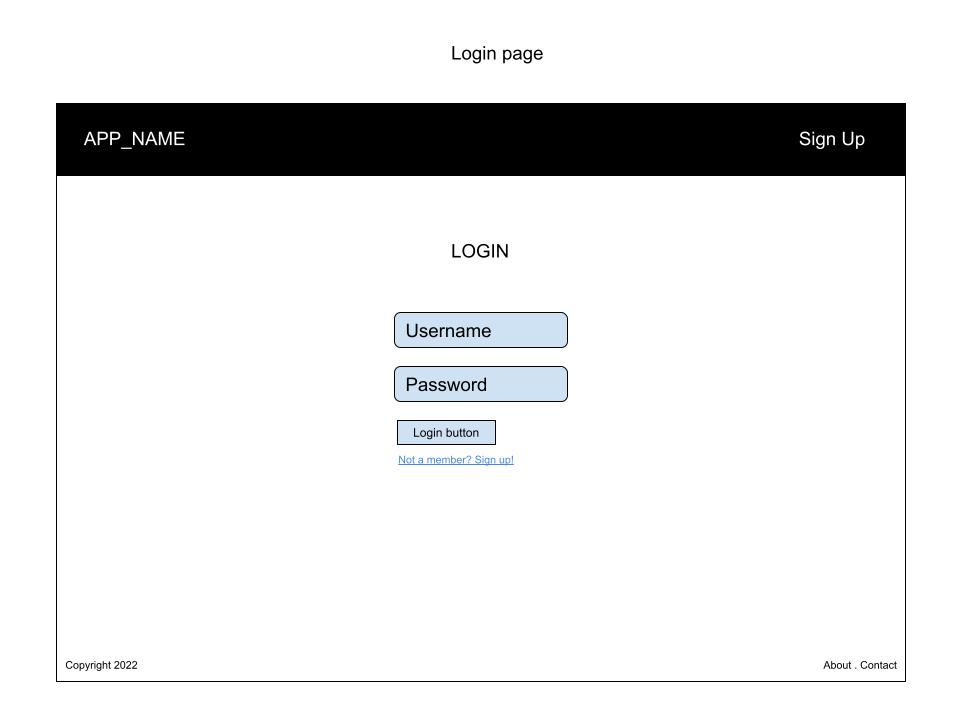
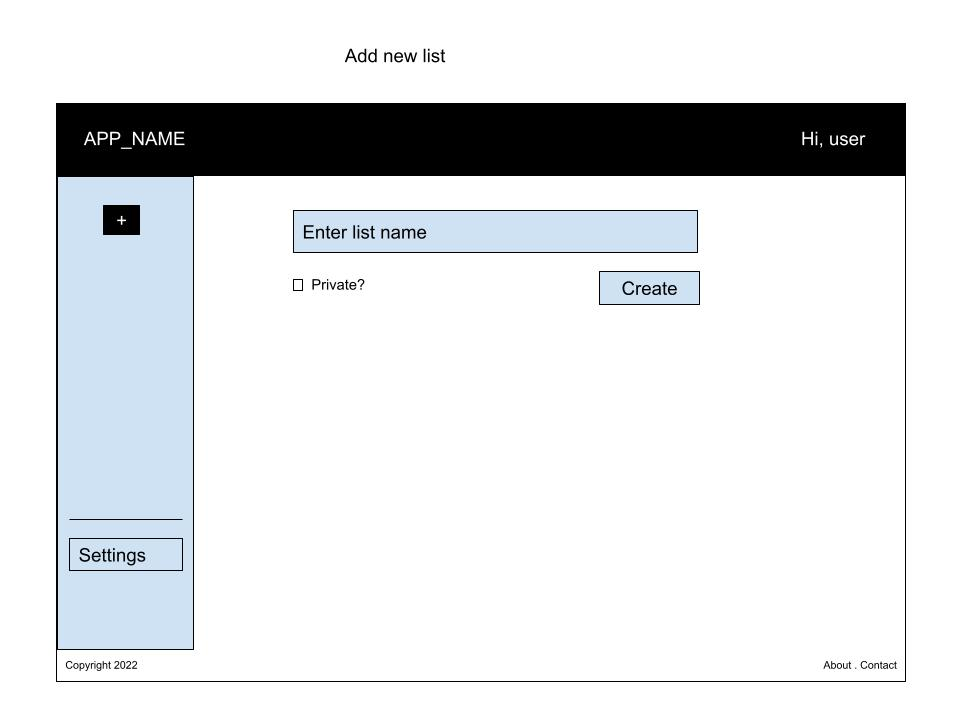
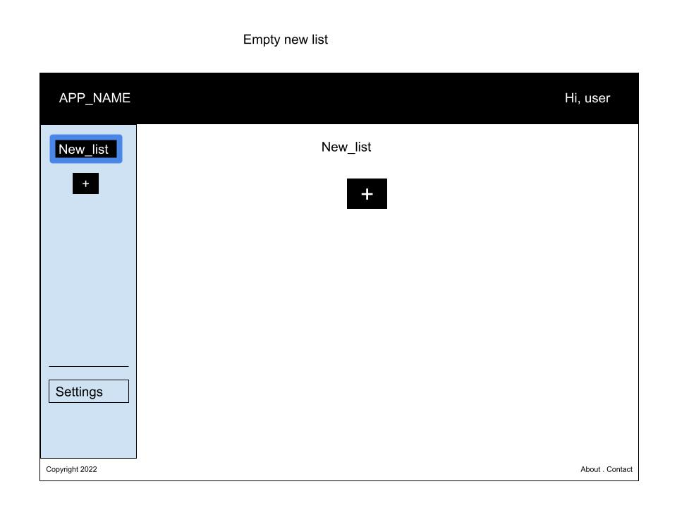
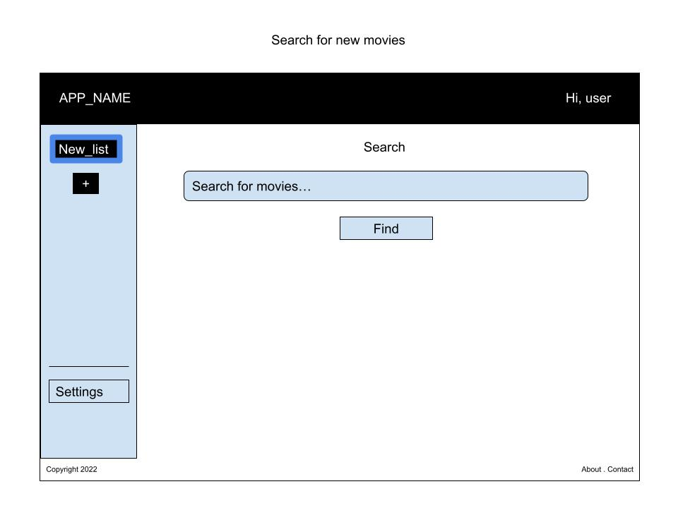

# A-Lister

A-Lister (working title) is an online 'to-watch' list keeper. A-Lister is a flask python app supported by a postgreSQL database, hosted on [github](https://github.com/davebdev/project02) and using heroku to deploy at [https://enigmatic-caverns-29903.herokuapp.com/](https://enigmatic-caverns-29903.herokuapp.com/). A-Lister uses an API developed at [The Movie DB](https://www.themoviedb.org/documentation/api) to supply all the movie data.

This has been created for Unit 2 of the General Assembly Software Engineering intensive (remote flex), cohort 08. This unit has been my first foray into Python.

## Database design

My approach to this app was to first try to get an understanding of the way the database would be structured. In tandem with this, I tried to come up with some wireframes for the pages that would appear, which solidified the user flow through the app, and also allowed me to amend the database structure to work with my intentions for the app, all before I'd written a single line of code. This approach meant I could properly size the scope of this project and remove a few extra things that I knew I wouldn't have time for in the week I had to build it. Some of the extra features I was hoping to incorporate were:
    - allowing users to 'follow' each other's lists/user pages
    - creating a search for public facing lists
    - a dynamic search bar which filtered results as the user types

The below diagram shows the original structure of the database:

### Storing movie data

In the approach to this app, I had a question in my mind about how much movie data to store in the database, considering I would be using an API to retrieve the data first. After a conversation with a colleague, [Chris](https://github.com/Chrispy1987), he suggested that it might be better to store the data needed for the app once the movie was committed to the list. He further explained that you can have a table specifically for the movie data, which the list data could reference by way of a movie id, so that you wouldn't be storing a version of the movie for every user, but rather that each user instance of the movie would draw from the one row in the movie table. He also suggested storing a count so that if the numbr of times that movie got used in various user lists got down to 1 and the final user was deleting the movie from their list, that movie could then also be deleted from the database so as to not take up unnecessary space. All of these ideas were great and I jumped onto them straight away.

The below diagram shows the restructured (v2) version of the database:

## Wireframes

The following images are basic wireframes built to both illustrate function and page structure, but also serves as a user journey through the app.

### Sign up

### Login

### Empty homepage (no lists)

### Create new list

### Empty new list

### Search for new movies to add

### User homepage (logged in) with several lists

### User homepage (not logged in), public facing

## BUGS!

-No bugs currently found

## TO DO:
- sharable link copied to clipboard
- rating: custom list order? / order by rating / by watched date / alphabetically

## Functions:

- users can create an account linked to a unique username so that their lists can be shared publically
- users can create an unlimited number of lists
- users can choose whether a list is public or private
- users can add any movie to their list, which will display the name, release date, tagline, overview and runtime of the movie
- users can mark when they've watched a film
- users can add notes, a rating and edit their 'watched date' for any film
- users can delete individual films from their lists
- users can select multiple films from their list to delete at once
- users can edit/delete list data
- users can update user settings (password, email, first name, last name)
- private lists only show to the user they belong to
- when logging in from another page on the site, the user will get taken back to that site once logged in.
- session expires after 30 minutes
